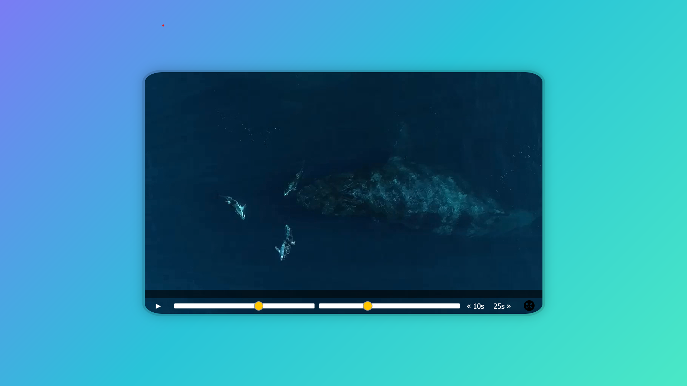

# HTML Custom Video Player

This is a solution to the [HTML Custom Video Player]() This is challenge from WesBos to train beginners Vanilla JS. This is Day1 Project.  

## Table of contents

- [Overview](#overview)
  - [The challenge](#the-challenge)
  - [Screenshot](#screenshot)
  - [Links](#links)
- [My process](#my-process)
  - [Built with](#built-with)
- [Author](#author)

## Overview

### The challenge

Users should be able to:

- Play or Pause the video with help of keys or button.
- Watch video in FullScreen by click a button or Double Click.

### Screenshot

### Links

- Solution URL: [Solution URL here](https://www.github.com/Ashraful-Fuqha/HTML-custom-video-player/)
- Live Site URL: [Live site URL here](https://ashraful-fuqha.github.io/html-custom-video-player/)

## My process

### Built with

- Semantic HTML5 markup
- CSS3
- Flexbox 
- Vanilla JS

## Author

- Website - Definetly
- GitHub - [@MjafarsadiqD](https://github.com/Ashraful-Fuqha)